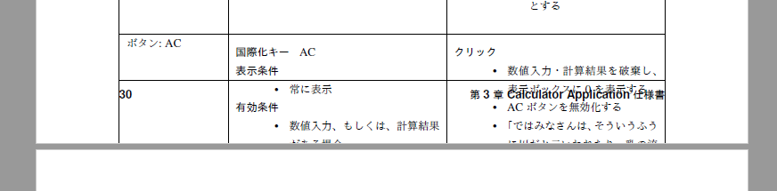

--------------------------------------------------------------------------------
基本設定
--------------------------------------------------------------------------------

.. contents::
   :local:


sphinx-quickstart
================================================================================

基本的にプロジェクト名等必須の項目以外はデフォルト設定で行う。

旧バージョン（v1.8）から大幅に簡略化されている。拡張子やマスタードキュメントも自動で設定され、
``index.rst`` が使用される。また、Makefileも作成される。

.. code-block::

   $ sphinx-quickstart.exe
   Welcome to the Sphinx 2.1.2 quickstart utility.

   Please enter values for the following settings (just press Enter to
   accept a default value, if one is given in brackets).

   Selected root path: .

   You have two options for placing the build directory for Sphinx output.
   Either, you use a directory "_build" within the root path, or you separate
   "source" and "build" directories within the root path.
   > Separate source and build directories (y/n) [n]:

   The project name will occur in several places in the built documentation.
   > Project name: Study Sphinx
   > Author name(s): kkAyataka
   > Project release []: 0.1.0

   If the documents are to be written in a language other than English,
   you can select a language here by its language code. Sphinx will then
   translate text that it generates into that language.

   For a list of supported codes, see
   https://www.sphinx-doc.org/en/master/usage/configuration.html#confval-language.
   > Project language [en]: ja

   Creating file .\conf.py.
   Creating file .\index.rst.
   Creating file .\Makefile.
   Creating file .\make.bat.

   Finished: An initial directory structure has been created.

   You should now populate your master file .\index.rst and create other documentation
   source files. Use the Makefile to build the docs, like so:
      make builder
   where "builder" is one of the supported builders, e.g. html, latex or linkcheck.


htmlでのセクション番号の有効化
================================================================================

``toctree`` のオプションで ``:numbered:`` を指定して、有効化する。
最上位のマスタードキュメントのみに設定すればよい。

.. code-block:: rst

   .. toctree::
      :maxdepth: 2
      :caption: Contents:
      :numbered:


図表番号の有効化
================================================================================

``conf.py`` で ``numfig`` を有効化する。

.. code-block:: python

   # General
   numfig = True


Read the Docs Sphinxテーマの有効化
================================================================================

``pip install sphinx_rtd_theme`` でテーマをインストールし ``conf.py`` でテーマを指定する。
テーマは少しカスタマイズして使用するため、カスタム用のcssを読み込むようにも設定する。

.. code-block:: python

   # conf.py

   import sphinx_rtd_theme

   extensions = [
     "sphinx_rtd_theme",
   ]

   # html
   html_theme = 'sphinx_rtd_theme'
   html_style = 'css/rtd_custom.css'


テーマのカスタマイズ
--------------------------------------------------------------------------------

次のようにcssファイルを準備する。設定内容はコメントを参照。
``_static`` フォルダ以下に、``_static/css/rtd_custom.css`` として保存し、上記のとおり、
``conf.py`` で設定して、有効化する。

.. code-block:: css

   @import url("theme.css");

   /* 横幅の指定を無くす */
   .wy-nav-content {
     max-width: none;
   }

   /* h1～h4に下線を引く*/
   h1, h2, h3, h4 {
     border-bottom: 1px solid #2980B9
   }

   /* 表は改行して表示する */
   .wy-table-responsive table th,
   .wy-table-responsive table td {
     white-space: normal;
   }


拡張リテラル
================================================================================

取り消し線や文字色の変更は標準の機能にはないため、独自に定義する。

ただし、htmlではうまくいくが、PDFでの取り扱いが難しいため、
PDFファイルを作る場合は使用を控える。

独自に ``role`` とcssを定義する。 ``role`` はファイル毎に設定が必要なため、
``conf.py`` の ``rst_prolog`` を使って、reSTを埋め込む。

.. code-block:: python

   rst_prolog = """
   .. role:: strike
      :class: strike

   .. role:: red
      :class: red
   """

それぞれの ``role`` 用のcss定義を追加する。

.. code-block:: css

   .strike {
     text-decoration: line-through;
   }

   .red {
     color: red;
   }


上記の準備をした上で、インラインリテラルとして使用する。
``:strike:`取り消し線``` で取り消し線がひかれ、``:red:`赤字``` で赤字になる。


latexpdf出力の調整
================================================================================


図の表示位置
--------------------------------------------------------------------------------

標準だと、ページ末で図が表示できない場合、図は次のページに行きつつ、
余ったスペースに図の後の文章が挿入される。
前後関係が崩れて読みにくいため、図と文章の順番が入れ替わらないように設定する。

``conf.py`` に以下を記述すると防げる。

.. code-block:: python

   latex_elements = {'figure_align':'H'}


大きな表の改ページ
--------------------------------------------------------------------------------



   表の表示崩れ


表に ``:class: longtable`` を明示することで、大きな表での改ページの崩れをを回避できる。
ただし、1行そのものが大きく、1ページを超える場合は対処できない。

.. code-block:: rst

   .. list-table:: 大きな表
      :header-rows: 1
      :class: longtable

標準設定だと、30行以下の表は途中で改ページされず、PDF化したときに表示が崩れる。
30行以上だとLaTeXのlongtableが有効化されるため、うまく改ページされる。


参考リンク
================================================================================

- Read the Docs Sphinx Theme: https://github.com/readthedocs/sphinx_rtd_theme
