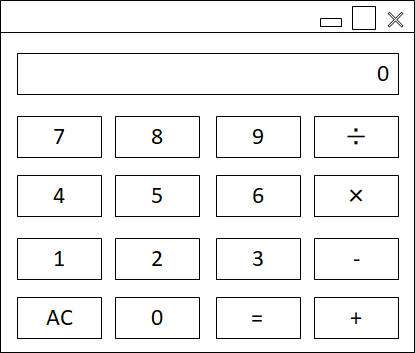

================================================================================
Calculator仕様書
================================================================================

:バージョン: |release|
:発行日付: 2019/7/15
:変更内容: - 初版

--------------------------------------------------------------------------------
概要
--------------------------------------------------------------------------------

入力された数値の四則演算を行い、計算結果を表示するアプリケーション。

--------------------------------------------------------------------------------
基本仕様
--------------------------------------------------------------------------------

.. list-table:: 基本仕様
   :header-rows: 1

   * - 項目
     - 内容
   * - 名前（実行ファイル名）
     - Calculator
   * - 対応OS
     - Windows 10 64-bit（1809以降）
   * - 言語
     - 日本語

--------------------------------------------------------------------------------
状態遷移
--------------------------------------------------------------------------------

.. figure:: images/state-machine.png
   :align: center

   画面遷移

--------------------------------------------------------------------------------
計算画面
--------------------------------------------------------------------------------

数値入力状態と結果表示状態での表示。画面構成は変わらず、内部状態と動作のみかわる。

   画面

ウィンドウの基本機能
================================================================================

.. list-table:: ウィンドウの基本機能
   :header-rows: 1

   * - 項目
     - 内容
   * - 最小化ボタン
     - 有効
   * - 最大化ボタン
     - 有効
   * - 閉じるボタン
     - 有効
   * - リサイズ
     - リサイズ可能。ウィンドウサイズに従って、中のコントロールサイズを変更する。

定義と動作
================================================================================

.. list-table:: 動作
   :header-rows: 1
   :widths: 2 4 4
   :class: longtable

   * - 要素
     - プロパティ
     - 動作
   * - テキスト: 数値表示
     - Localize Key
         なし

       表示条件
         - 常に表示

       有効条件
         - 常に有効

       初期値
         - 0
     - - 入力中の数値、または、計算結果を表示する
   * - ボタン: 0
     - Localize Key
         なし

       表示条件
         - 常に表示

       有効条件
         - 数値入力中で、数値が0以外の場合
     - クリック
         - 入力中の数値を1桁増やす（10倍する）
   * - ボタン: 1～9
     - Localize Key
         なし

       表示条件
         - 常に表示

       有効条件
         - 数値入力中の場合
     - クリック
         - 入力中の値が0なら、クリックした数値を入力値とする
         - 入力中の値が0以外なら、入力中の数値を1桁増やして、クリックしたボタンの数値を加える
           (10培して、クリックした値を足す）
   * - ボタン: 四則演算（＋、－、×、÷）
     - Localize Key
         なし

       表示条件
         - 常に表示

       有効条件
         - 常に有効
     - クリック
         - 現在の表示値（入力中の値か計算結果の値）と四則演算の方法を記録し、「=」ボタンを有効にする
         - 数値表示を0にして、数値入力状態にする
   * - ボタン: =
     - Localize Key
         なし

       表示条件
         - 常に表示

       有効条件
         - 四則演算ボタンが押され、演算方法を記録している場合
     - クリック
         - 現在の入力値と記録した値を、記録した四則演算方法で計算する
         - 計算結果を表示し、計算結果表示状態にする
   * - ボタン: AC
     - Localize Key
         なし

       表示条件
         - 常に表示

       有効条件
         - 入力中の数値が0以外の場合
         - 四則演算ボタン押され、数値と演算方法を記録している場合
         - 結果表示状態の場合
     - クリック
         - 入力中の数値、数値と演算方法の記録、結果表示を削除する
         - 数値入力状態にして、0を表示する
         - ACボタンが無効になる
   * - ボタン: ウィンドウの閉じる
     - Localize Key
         なし

       表示条件
         - 常に表示

       有効条件
         - 常に有効
     - クリック
         - ウィンドウを閉じて、アプリケーションを終了する

動作詳細
================================================================================
