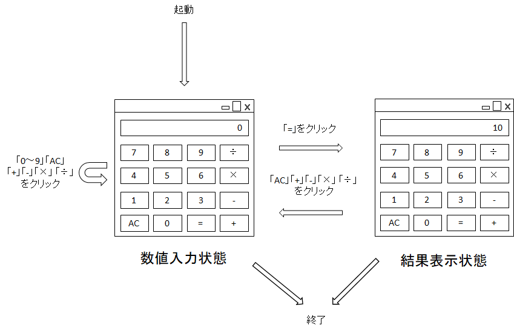

================================================================================
Calculator仕様書
================================================================================

:バージョン: |release|
:発行日付: 2019/7/15
:変更内容: - 初版

.. contents:: 目次
   :local:

--------------------------------------------------------------------------------
概要
--------------------------------------------------------------------------------

入力された数値の四則演算を行い、計算結果を表示するアプリケーション。

背景
================================================================================

単純な電卓アプリを想定して、Sphinxでの仕様書の書き方を考える。

--------------------------------------------------------------------------------
基本仕様
--------------------------------------------------------------------------------

.. list-table:: 基本仕様
   :header-rows: 1

   * - 項目
     - 内容
   * - 名前（実行ファイル名）
     - Calculator
   * - 対応OS
     - Windows 10 64-bit（1809以降）
   * - 実行不ファイルのアーキテクチャ
     - 64-bit
   * - 言語
     - 日本語
   * - インストーラー
     - 無し

開発言語・言語・ライブラリ
================================================================================

.. list-table:: プラットフォーム
   :header-rows: 1

   * - 項目
     - 内容
   * - プラットフォーム
     - WPF on .NET Core
   * - 言語
     - C#

基本機能
================================================================================

- 整数値の四則演算ができる
- 少数の計算はできない
- オーバーフロー/アンダーフローは無視する

用語定義
================================================================================

.. glossary::

   入力値の範囲
      数値入力できる最大の値。「-9,999,999〜+9,999,999」とする。

   計算値の範囲
      「-9,223,372,036,854,775,808〜+9,223,372,036,854,775,807」とする。
      これは64-bit整数長の範囲に一致する。

--------------------------------------------------------------------------------
起動方法
--------------------------------------------------------------------------------

- Calculator.exeをダブルクリックして起動する

アプリケーション起動時の処理
================================================================================

- 前回終了時のウィンドウサイズと位置で、計算画面を表示する

  - 前回終了時のウィンドウ座標が、画面外の場合、プライマリスクリーンの中央に表示する

アプリケーション終了時の処理
================================================================================

- 特になし

--------------------------------------------------------------------------------
状態遷移
--------------------------------------------------------------------------------

   画面遷移

--------------------------------------------------------------------------------
計算画面
--------------------------------------------------------------------------------

数値入力状態と結果表示状態での表示。画面構成は変わらず、内部状態と動作のみかわる。

.. figure:: images/calc-view.png
   :align: center

   画面

ウィンドウの基本機能
================================================================================

.. list-table:: ウィンドウの基本機能
   :header-rows: 1

   * - 項目
     - 内容
   * - 最小化ボタン
     - 有効
   * - 最大化ボタン
     - 有効
   * - 閉じるボタン
     - 有効
   * - リサイズ
     - リサイズ可能。ウィンドウサイズに従って、中のコントロールサイズが変わる。

定義と動作
================================================================================

.. list-table:: 動作
   :header-rows: 1
   :widths: 2 4 4
   :class: longtable

   * - 要素
     - プロパティ
     - 動作
   * - テキスト: 数値表示
     - Localize Key
         なし

       表示条件
         - 常に表示

       有効条件
         - 常に有効

       初期値
         - 0
     - - 入力中の数値、または、計算結果を表示する
   * - ボタン: 0
     - Localize Key
         なし

       表示条件
         - 常に表示

       有効条件
         - 数値入力中で、数値が0以外の場合
     - クリック
         - 入力中の数値を1桁増やす（10倍する）
         - 入力後の値が :term:`入力値の範囲` を超える場合は何もしない
   * - ボタン: 1～9
     - Localize Key
         なし

       表示条件
         - 常に表示

       有効条件
         - 数値入力中の場合
     - クリック
         - 入力中の値が0なら、クリックした数値を入力値とする
         - 入力中の値が0以外なら、入力中の数値を1桁増やして、クリックしたボタンの数値を加える
           (10培して、クリックした値を足す）
         - 入力後の値が :term:`入力値の範囲` を超える場合は何もしない
   * - ボタン: 四則演算（+、-、×、÷）
     - Localize Key
         なし

       表示条件
         - 常に表示

       有効条件
         - 常に有効
     - クリック
         - 現在の表示値（入力中の値か計算結果の値）と四則演算の方法を記録し、「=」ボタンを有効にする
         - 数値表示を0にして、数値入力状態にする
   * - ボタン: =
     - Localize Key
         なし

       表示条件
         - 常に表示

       有効条件
         - 四則演算ボタンが押され、演算方法を記録している場合
     - クリック
         - 記録した値に対して、現在の入力値を、記録した四則演算方法で計算する

           - e.g. 10（記録した値） +（演算方法） 7（現在の入力値）

         - 計算結果を表示し、計算結果表示状態にする
         - オーバーフロー/アンダーフローは無視する

           - :term:`計算値の範囲` を超える場合、値はオーバーフロー/アンダーフローする。
             符号が反転し、計算値として正しい値を表示しない
   * - ボタン: AC
     - Localize Key
         なし

       表示条件
         - 常に表示

       有効条件
         - 入力中の数値が0以外の場合
         - 四則演算ボタン押され、数値と演算方法を記録している場合
         - 結果表示状態の場合
     - クリック
         - 入力中の数値、数値と演算方法の記録、結果表示を削除する
         - 数値入力状態にして、0を表示する
         - ACボタンが無効になる
   * - ボタン: ウィンドウの閉じる
     - Localize Key
         なし

       表示条件
         - 常に表示

       有効条件
         - 常に有効
     - クリック
         - ウィンドウを閉じて、アプリケーションを終了する

動作詳細
================================================================================

アプリケーションの起動
--------------------------------------------------------------------------------

- IF 前回終了時の計算画面のサイズと位置が保存されている

  - サイズと位置を読み込む

- ELSE

  - データ無い場合、プライマリスクリーンの中央に表示するようにサイズと位置を計算する

- 計算画面を表示

アプリケーションの終了
--------------------------------------------------------------------------------

- 特になし

計算画面が閉じるのを検出
--------------------------------------------------------------------------------

- 計算画面を閉じたときにウィンドウサイズと位置を保存する
- アプリケーションを終了する

ウィンドウの表示
--------------------------------------------------------------------------------

- `状態の初期化`_ を実行する

ウィンドウを閉じる
--------------------------------------------------------------------------------

- 計算画面を閉じる

0ボタンのクリック
--------------------------------------------------------------------------------

- 入力中の数値を10培
- 表示を更新する

1～9ボタンのクリック
--------------------------------------------------------------------------------

- IF 入力中の数値が0

  - クリックされたボタンの値を入力値にする

- ELSE（入力中の数値が0以外）

  - 入力中の数値を10倍する
  - クリックされたボタンの値を10倍した値に足す

- `ボタンの有効判定`_ を行い、状態を更新する

+、-、×、÷ボタンのクリック
--------------------------------------------------------------------------------

- 入力中の値を結果値として保存する
- クリックされた演算方法を保存する
- 入力中の値を0にする
- 表示を更新する
- `ボタンの有効判定`_ を行い、状態を更新する

=ボタンのクリック
--------------------------------------------------------------------------------

- 保存している結果値に、保存している演算方法で、入力中の値を計算し、結果値を更新する
- 計算結果を表示する（結果表示状態に遷移）
- `ボタンの有効判定`_ を行い、状態を更新する

ACボタンのクリック
--------------------------------------------------------------------------------

- `状態の初期化`_ を実行する

共通処理
--------------------------------------------------------------------------------

_`状態の初期化`
  - 入力値を0にする
  - 記録中の演算方法をクリアする
  - 結果値を0にする
  - `ボタンの有効判定`_ を行う

_`ボタンの有効判定`
  - 0ボタン

    - IF 数値入力状態 AND 入力中の数値が0でない

      - 有効化する

    - ELSE

      - 無効化する

  - 1～9ボタン

    - IF 数値入力状態

      - 有効化する

    - ELSE

      - 無効化する

  - =ボタン

    - IF 演算方法を記録している

      - 有効化する

    - ELSE

      - 無効化する

  - ACボタン

    - IF 数値入力中 AND 数値が0以外

      - 有効化する

    - ELSE IF 演算方法を記録している

      - 有効化する

    - ELSE IF 計算結果表示状態

      - 有効化する

    - ELSE

      - 無効化する
